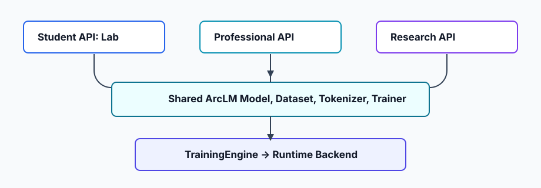

# ArcLM

ArcLM is a compact Python framework for causal language-model workflows. It is
being built around ArcLM-owned model, tokenizer, artifact, and training
contracts while using PyTorch as the current tensor/autograd/runtime backend.



## Install

```bash
pip install -e ".[dev]"
```

For a minimal runtime install from this repository:

```bash
pip install -e .
```

## Start

```python
from arclm import Lab

lab = Lab()
dataset = lab.dataset(text="alpha beta gamma delta alpha beta gamma delta")
model = lab.model(data=dataset, size="tiny")
history = lab.train(epochs=1, steps=1, shuffle=False)
```

## API Levels

ArcLM exposes three levels of control over the same underlying engine.

| Level | Primary API | Purpose |
| --- | --- | --- |
| Student | `Lab` | Learn and run small workflows with good defaults. |
| Professional | `Dataset`, `Tokenizer`, `Model`, `Runtime`, `Trainer`, config objects | Build repeatable training and fine-tuning pipelines. |
| Research | `arclm.research` | Replace losses, strategies, tokenizers, architectures, callbacks, evaluators, and backend pieces intentionally. |

The layers flow downward:

```text
Lab
  -> Model / Dataset / Tokenizer / Trainer / Runtime
  -> arclm.research and core contracts
  -> TrainingEngine
  -> Runtime backend
```

## Currently Supported

- Native compact causal language model architecture: `arclm-native-causal-lm`.
- Unified `Tokenizer` facade with word and character engines.
- Optional lazy SentencePiece tokenizer engine when `sentencepiece` is installed.
- ArcLM-owned training loop with epochs, per-epoch steps, validation, callbacks,
  checkpoints, resume, metrics, gradient accumulation, and early stopping.
- Full fine-tuning and native LoRA-style adapter fine-tuning for the current
  native model.
- `.arcmodel` save/load with config, tokenizer, architecture metadata, weights,
  integrity hashes, and training metadata.
- `.arcadapter` save/load for native LoRA adapter tensors.

## Planned, Not Yet Core

- Hugging Face compatibility as an optional adapter layer.
- Additional ArcLM-native model families.
- Richer tokenizer algorithms such as ArcLM-native BPE, WordPiece, and Unigram.
- Multi-shard and single-file artifact workflows are started, but richer
  migration/version policy is still planned.

## Guides

- [Getting Started](guide/getting-started.md)
- [Student / Lab API](guide/student-lab.md)
- [Professional API](guide/professional.md)
- [Research API](guide/research.md)
- [Tokenizers](guide/tokenizers.md)
- [Training and Fine-Tuning](guide/training-finetuning.md)
- [Artifacts](guide/artifacts.md)
- [Current Status](guide/status.md)
- [Public API](api/public-api.md)
